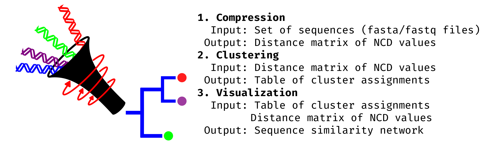

# snacc: Compress and compare pathogen genomes without sequence alignment
snacc is a pipeline that implements the normalized compression distance(NCD) specifically for biological data. The workflow primarily consists of 3 stages: compression, clustering, and visualization. The goal of this project is to provide a faster method of comparing large-scale pathogen genomes to conventional alignment-based methods such as BLAST by exploiting the inherent redundancies of the genetic code.

## Table of contents
- [Workflow](#workflow)
- [Installation and Dependencies](#installation-and-dependencies)
- [Set up a virtual env (optional)](#set-up-a-virtual-env-optional)
- [Install the dependencies](#install-the-dependencies)
- [Usage](#usage)
- [Examples](#examples)


## Workflow


## Installation and Dependencies

- [`python3`](https://python.org)
- [`numpy`](https://numpy.org)
- [`scipy`](https://scipy.org)
- [`pandas`](https://pandas.pydata.org)
- [`matplotlib`](https://matplotlib.org)
- [`sklearn`](http://scikit-learn.org/stable/)
- [`py-lz4framed`](https://github.com/Iotic-Labs/py-lz4framed)

### Set up a virtual env (optional)
To install virtualenv use the following command in your terminal:

    pip install virtualenv

Then in the directory you want to use, create a virtualenv named env:

    virtualenv -p python3.6 env

And then activate the environment with:

    source env/bin/activate

You can leave the virtualenv at any time with the command:

    deactivate

### Install the dependencies

To install the dependencies:

    pip install -e .

#### Optional: install BWT disk functionality
To use snacc with the [BWT-Disk](https://people.unipmn.it/manzini/bwtdisk/) function you can run the following commands:
```
cd /path/to/bioncd-hackseq/bin/bwt_disk
make clean
make
```

## Usage
```
$ snacc --help
Usage: snacc [OPTIONS]

Options:
  -f, --fasta FILE                FASTA file containing sequence to compare.
  -d, --directory DIRECTORY       Directory containing FASTA files to compare.
  -n, --num-threads INTEGER       Number of Threads to use (default 5 * number
                                  of cores).
  -o, --output FILE               The location for the output CSV file.
  -s, --save-compression DIRECTORY
                                  Save compressed sequence files to the
                                  specified directory.
  -c, --compression [lzma|gzip|bzip2|zlib|lz4|bwt-disk]
                                  The compression algorithm to use. Defaults
                                  to lzma.
  --show-progress / --no-show-progress
                                  Whether to show a progress bar for computing
                                  compression distances.
  -r, --reverse_complement        Whether to use the reverse complement of the
                                  sequence.
  -b, --burrows-wheeler           Whether to compute the Burrows-Wheeler
                                  Tranform prior to compression and reverse
                                  complement (default 256 MB).
  -bM, --bwte-mem INTEGER         BWT-Disk option: The amount of memory in MB
                                  for use in the bwt-disk executable.
  -bC, --bwte-compress [None|gzip|rle-range-encoding|dna5-symbol|lzma]
                                  BWT-Disk Option: The compression to use when
                                  calling bwt-disk before compression, may
                                  require separate libraries if not using
                                  default.
  -l, --log-type [html|md]        The output format for the report. Defaults
                                  to html.
  --no-show                       If mode is html, use this flag to prevent
                                  automatically opening the log in the
                                  browser.
  -h, --help                      Show this message and exit.
```

## Examples

0) Before calling snacc
```
source activate my_env
```
1) Most basic usage
```
snacc -d [folder with sequences] -o [output name]
```
2) Intermediate: customize number of threads and compression algorithm
```
snacc -d [folder with sequences] -o [output name] -n 24 -c gzip
```
3) Full control
```
snacc \
--directory [folder with sequences] \
--output [output name] \
--num-threads 24 \
--compression zlib \
--save-compression [folder to store zipped files] \
--show-progress False
```

### Using bwt-disk functionality
The following command will run a burrows-wheeler transform in disk using the default amount of memory (256MB) and then compress using range encoding.
```
snacc\
--directory [folder with sequences] \
--output [output name] \
--num-threads 24 \
--compression bwt-disk \
--bwte-compress rle-range-encoding
--save-compression [folder to store zipped files] \
--show-progress False
```
